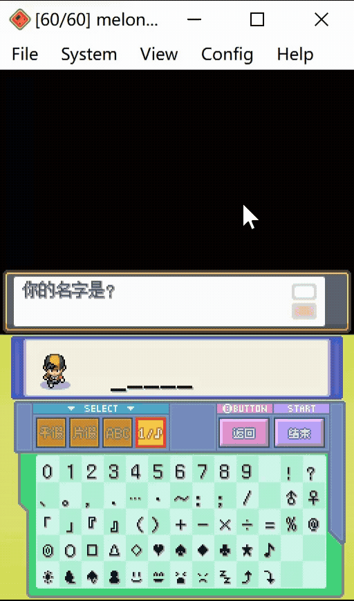
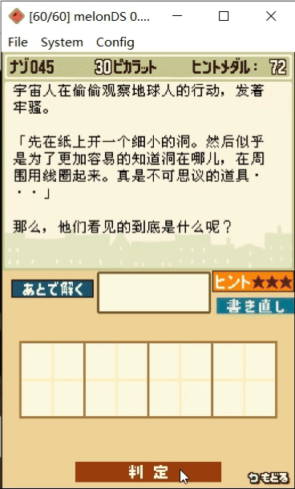
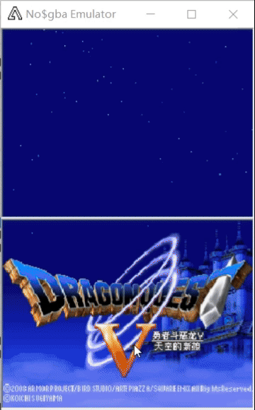

# Nitro Keyboard Plugin

Nitro Keyboard Plugin 是一个为 NDS 汉化游戏开发的、通用的中文输入键盘插件。

接入键盘插件后，可以在游戏内呼出键盘进行输入。

> **2026 年 8 月 8 日更新**
>
> 新增可选的扩展拼音输入法：
>
> - 支持词语拼写，同时检索单字和词语候选
> - 候选字词通过触摸直接输入，并可点击左右箭头翻页
> - 使用适合 NDS 低内存环境的两级 `pinyin_db.bin`，按需读取词库数据
> - 默认词库来自 [rime-pinyin-simp](https://github.com/rime/rime-pinyin-simp)，也可以导入经 `pypinyin` 生成并人工校对的自定义 Rime YAML 词库
>
> 在 `config.mk` 中设置 `ENABLE_KEYBOARD_PINYIN_EX=1` 即可启用；默认值仍为 `0`，继续使用原有拼音输入法。词库生成和放置方法请参阅[接入文档](docs/HowToBuild.md)。

> **2026 年 5 月 8 日更新**
>
> 支持插入编辑，并且可以设置初始字符，效果见下图。

## 效果演示

<table>
  <tr>
    <th>心金</th>
    <th>雷顿教授</th>
  </tr>
  <tr>
    <td align="center"></td>
    <td align="center"></td>
  </tr>
  <tr>
    <th>宝可梦信长</th>
    <th>勇者斗恶龙 5</th>
  </tr>
  <tr>
    <td align="center"></td>
    <td align="center"></td>
  </tr>
</table>

像雷顿教授这种使用手写输入的游戏，也可以使用中文来回答了。

## 演示补丁

雷顿教授的键盘插件演示补丁：

- 下载地址：[百度网盘](https://pan.baidu.com/s/1CLfQgl8Y-_R0AswGS3-7_Q)
- 提取码：`r7i3`
- 使用方法：使用 xdelta 工具，将补丁应用到《雷顿教授与不可思议的小镇》简体汉化版
- 呼出方式：在第 45 题“宇宙人之谜”的解答页面中，按下 `R + X` 键即可呼出中文键盘进行解答

## 接入文档

[查看接入文档](docs/HowToBuild.md)

接入遇到问题时，请提 issue。

## 资料引用

- 最初的灵感来源：[DSTWO 的 DS 游侠](http://chn.supercard.sc/manual/dstwo/dsyx.htm)，其中有一个简易的键盘供用户编辑金手指
- 重绘游戏画面的实现：一部分参考了 [nds-bootstrap](https://github.com/DS-Homebrew/nds-bootstrap) 的 inGameMenu 实现
- 扩展拼音输入法的默认词库：[rime-pinyin-simp](https://github.com/rime/rime-pinyin-simp)，本项目通过 Git submodule 引用
