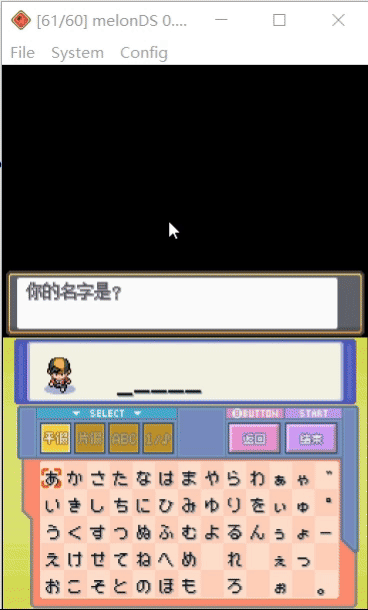

Nitro Keyboard Plugin是一个为NDS汉化游戏开发的通用的支持中文输入的键盘插件  
接入键盘插件后，可以在游戏内呼出键盘进行输入，以下为效果演示  
  
  
像雷顿教授这种使用手写输入的游戏，也可以使用中文来回答了  
  
  

雷顿教授的键盘插件演示补丁下载，  
链接:[度盘地址](https://pan.baidu.com/s/1CLfQgl8Y-_R0AswGS3-7_Q) 提取码:r7i3  
请使用xdelta工具将补丁打在雷顿教授与不可思议的小镇简体汉化版上  
在第45题“宇宙人之谜”的解答页面中，按下R+X键即可呼出中文键盘进行解答  

接入文档：[点击查看](docs/HowToBuild.md)  
接入遇到问题时请提issue  

资料引用：  
最初的灵感来源：[DSTWO的DS游侠](http://chn.supercard.sc/manual/dstwo/dsyx.htm)，有一个简易的键盘供用户编辑金手指  
重绘游戏画面的实现：一部分参考了[nds-bootstrap](https://github.com/DS-Homebrew/nds-bootstrap)的inGameMenu的实现  
